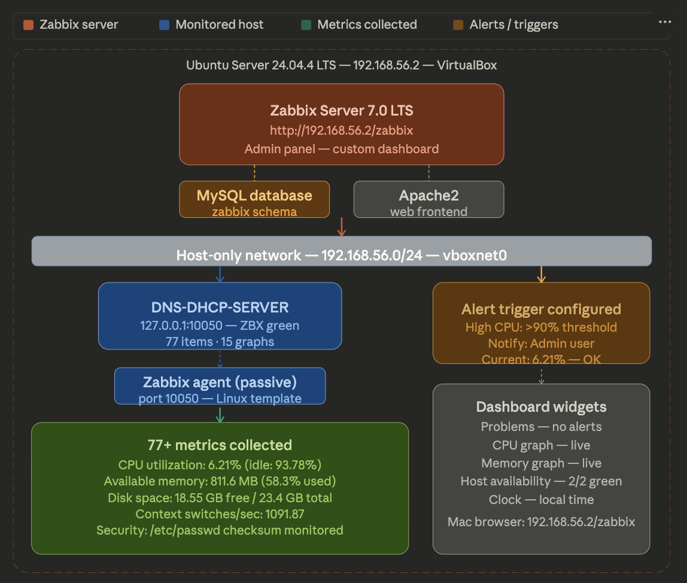

# Network Monitoring Lab — Zabbix 7.0 LTS

> Deployed Zabbix 7.0 LTS on Ubuntu Server 24.04 to implement enterprise-grade
> infrastructure monitoring — collecting 77+ live metrics including CPU, memory,
> disk, and network statistics with a custom dashboard and alerting configured.

📄 **[View Full Lab Documentation (PDF)](./Zabbix_Monitoring_Lab_Documentation.pdf)**



---

## Objective

Deploy Zabbix monitoring server to monitor infrastructure health proactively —
Simulating the network operations monitoring found in every enterprise IT environment.

---

## Environment

| Component | Details |
|-----------|---------|
| Monitoring Tool | Zabbix 7.0 LTS |
| Server OS | Ubuntu Server 24.04.4 LTS (aarch64) |
| Database | MySQL |
| Web Server | Apache2 |
| Server IP | 192.168.56.2 |
| Web Interface | http://192.168.56.2/zabbix |
| Monitored Hosts | 2 (DNS-DHCP-SERVER + Zabbix server) |
| Agent Type | Zabbix Agent passive — port 10050 |
| Template | Linux by Zabbix agent |

---

## What Was Monitored

| Category | Metric | Live Value |
|----------|--------|-----------|
| CPU | CPU utilization | 6.21% |
| CPU | CPU idle time | 93.78% |
| CPU | Context switches/sec | 1091.87 |
| Memory | Available memory | 811.6 MB |
| Memory | Memory utilization | 58.3% |
| Storage | Space available | 18.55 GB |
| Storage | Space total | 23.4 GB |
| Alert | High CPU trigger | >90% threshold |

---

## Dashboard Widgets

| Widget | What It Shows |
|--------|--------------|
| Problems | Active alerts (none = healthy) |
| CPU Graph | Real-time CPU utilization over time |
| Memory Graph | Real-time memory utilization over time |
| Host availability | 2 hosts green — all available |
| Clock | Live local time |

---

## Installation Commands

```bash
# Install Zabbix repository
wget https://repo.zabbix.com/zabbix/7.0/ubuntu/pool/main/z/zabbix-release/zabbix-release_latest+ubuntu24.04_all.deb
sudo dpkg -i zabbix-release_latest+ubuntu24.04_all.deb
sudo apt update

# Install components
sudo apt install zabbix-server-mysql zabbix-frontend-php zabbix-apache-conf zabbix-sql-scripts zabbix-agent -y

# Configure database
sudo mysql
CREATE DATABASE zabbix CHARACTER SET utf8mb4 COLLATE utf8mb4_bin;
CREATE USER 'zabbix'@'localhost' IDENTIFIED BY 'zabbix';
GRANT ALL PRIVILEGES ON zabbix.* TO 'zabbix'@'localhost';
FLUSH PRIVILEGES;

# Import schema
zcat /usr/share/zabbix-sql-scripts/mysql/server.sql.gz | mysql --default-character-set=utf8mb4 -uzabbix -p zabbix

# Start services
sudo systemctl restart zabbix-server zabbix-agent apache2
sudo systemctl enable zabbix-server zabbix-agent apache2
```

---

## Verification Screenshots

| Screenshot | What It Proves |
|-----------|---------------|
| `dashboard.png` | Full dashboard — CPU, Memory, Host availability, Problems |
| `latest_data.png` | 77 live metrics updating every 20–40 seconds |
| `hosts.png` | Both hosts green ZBX — agent responding |
| `cpu_graph.png` | CPU utilization history with trigger configured |

---

## Skills Demonstrated

- Zabbix 7.0 LTS installation and configuration
- MySQL database setup and schema import
- Host monitoring with Zabbix agent
- Custom dashboard creation with multiple widgets
- Alert trigger configuration (High CPU >90%)
- 77+ metrics collection — CPU, memory, disk, security
- Apache web server configuration
- Linux service management with systemctl

---

## Part of My IT Portfolio

| Project | Repo |
|---------|------|
| Project 1 — VLAN & Inter-VLAN Routing | [vlan-intervlan-routing-lab](https://github.com/Daksh2601/vlan-intervlan-routing-lab) |
| Project 2 — DNS & DHCP Server on Linux | [dns-dhcp-linux-lab](https://github.com/Daksh2601/dns-dhcp-linux-lab) |
| Project 3 — Active Directory Home Lab | [active-directory-lab](https://github.com/Daksh2601/active-directory-lab) |
| Project 4 — Site-to-Site VPN | [site-to-site-vpn-lab](https://github.com/Daksh2601/site-to-site-vpn-lab) |
| Project 5 — Network Monitoring with Zabbix (this repo) | [network-monitoring-zabbix-lab](https://github.com/Daksh2601/Network-Monitoring-Lab---Zabbix-7.0)|

*Daksh Patel · CCNA Certified · [LinkedIn](https://www.linkedin.com/in/pateldaksh)*
